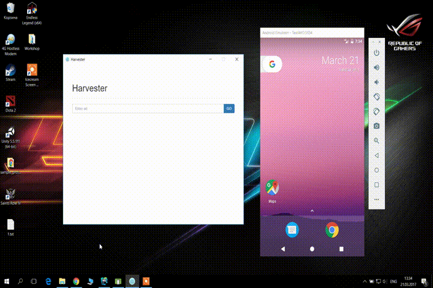

# Harvester

Launches Android libs example applications hosted on github.

<p align="center">
    
</p>

## Getting started

The following instructions will show multiple methods of launching this application.

### Prerequisites

Before starting to work with this project your local machine should have:

* NodeJS v6.*
* Git
* JDK 8 with `JAVA_HOME` in your environment variable
* Android SDK, with installed SDK build tools and `ANDROID_HOME` in your environment variable. Also `$ANDROID_HOME/tools` and `$ANDROID_HOME/platform-tools` should also be in `PATH` environment variable

** Both Pre-build and source projects should be placed in folder with short path length to avoid Android build errors! **

### Pre-build projects

[Releases page](https://github.com/ant-nomad/harvester/releases) has pre-build desktop applications for each specific platform.

### Using source

Use git command to clone this project to your local machine:

```
git clone https://github.com/ant-nomad/harvester.git
```

Install all required dependencies with npm:

```
npm install
```

#### Using browser to work with project

In your cloned project you should run following commands:

```
npm run webpack-devserver

npm run web
```

After successful launch, open `localhost:8050` in your browser

#### Using electron to test desktop version

```
// This command will make webpack to bundle all scripts located in /scripts/client in one script
npm run webpack-build

npm run start
```

#### Build complete desktop version

```
// This command will make webpack to bundle all scripts located in /scripts/client in one script
npm run webpack-build

// This command will generate final desktop version of this project in /build folder
npm run build
```

### Contributing

We welcome and encourage all pull requests.

### Authors

* [Mussabekov Daniyar](https://github.com/SuperMasterBlasterLaser)
* [Zhailkhan Murager](https://github.com/Mura75)
* Merey Bayzhokin

See also the list of [contributors](https://github.com/ant-nomad/harvester/graphs/contributors) who participated in this project.
